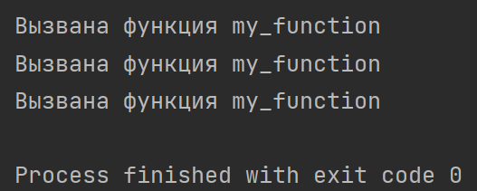

# Лабораторная работа №8
## Сложность: Rare
## Вариант №2
### Задание
1. Решите обе задачи своего варианта.
2. Примените декоратор к замыканию.
3. Оформите отчёт в `README.md.` Отчёт должен содержать:
    - Условия задач
    - Описание проделанной работы
    - Скриншоты результатов
    - Ссылки на используемые материалы
### Ход работы
#### Задача 1
Замыкание для получение текста ответа на запрос к API, например https://dogapi.dog/api/v2/facts.
```python
import requests

def apirequestclosure(url):
    def makeapirequest():
        response = requests.get(url)
        if response.statuscode == 200:
            return response.text
        else:
            return None
    return makeapirequest

dogfactapi = apirequestclosure('https://dogapi.dog/api/v2/facts')
dogfact = dogfactapi()
print(dogfact)
```
- Результаты:
```
{"data":[{"id":"8fa94033-0160-4f27-a6b0-009e77bef24c","type":"fact","attributes":{"body":"Dogs have lived with humans for over 14,000 years. Cats have lived with people for only 7,000 years."}}]}
```
```
{"data":[{"id":"ce76e860-3601-4586-8fe4-2bfeee1503b7","type":"fact","attributes":{"body":"Dachshunds were originally bred to fight badgers."}}]}
```
```
{"data":[{"id":"469910f2-ead5-4af1-9314-e1f3b8e66156","type":"fact","attributes":{"body":"The average lifespan of a dog is 10-13 years."}}]}
```
#### Задача 2
```python
import time

def rate_limit(limitpersecond):
    def decorator(func):
        last_called = 0

        def wrapper(*args, **kwargs):
            nonlocal last_called
            elapsed = time.time() - last_called
            if elapsed < 1 / limitpersecond:
                time.sleep(1 / limitpersecond - elapsed)
            last_called = time.time()
            return func(*args, **kwargs)

        return wrapper

    return decorator

@rate_limit(2)  # Ограничение на 2 вызова в секунду
def my_function():
    print("Вызвана функция my_function")

my_function()
time.sleep(0.5)
my_function()
my_function()
```
В этом коде `rate_limit` - это декоратор, который принимает ограничение в вызовах в секунду в качестве аргумента. Декоратор возвращает функцию-обёртку `wrapper`, которая проверяет, прошло ли достаточно времени с момента последнего вызова функции. Если необходимое время еще не прошло, то функция-обёртка задерживает выполнение до тех пор, пока не будет возможно выполнить вызов.
- Скриншот результата:


#### Декоратор к замыканию:
```python
@rate_limit(1)  # Ограничение на 1 вызов в секунду
def get_dog_fact():
    return api_request_closure("https://dogapi.dog/api/v2/facts")()

dog_fact = get_dog_fact()
print(dog_fact)
```
- Результат:
```
{"data":[{"id":"67f1bc7c-1b7c-431e-a6fc-0b767902a92f","type":"fact","attributes":{"body":"The tallest living dog is a Great Dane named Zeus, who measured 44 inches at the shoulder."}}]}
```
#### Ссылки на используемые материалы:
- https://evil-teacher.on.fleek.co/prog_pm/lab08/
- https://gpt-open.ru/programmist


# lab08
